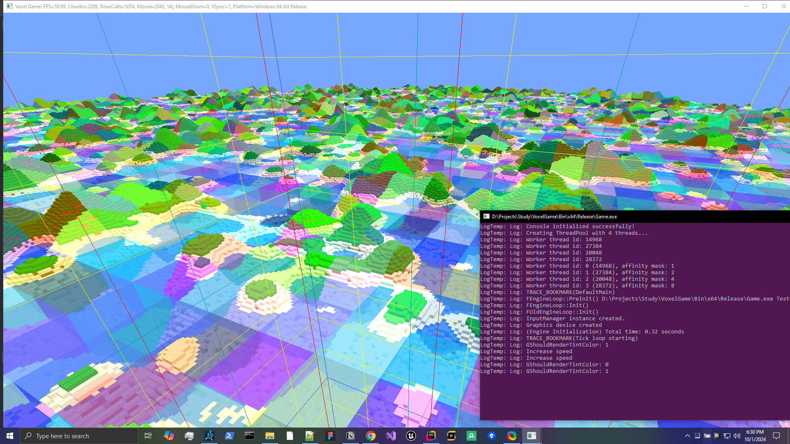

# VoxelGame

A personal project exploring a standalone C++ game engine exploring voxels and procedural world generation.

Uses no libraries other than C++ std and core Direct3D

- Core Defines and Macros
- Platform agnostic classes (timing, OS window, threading)
- Multi-threaded tasks (threadpool)
- Core 3D Math classes (matrix, vector)
- 3D Noise generation (perlin, simplex)
- Camera, PlayerController, InputManager
- VoxelCore Library (worlds, chunks, blocks)
- Graphis classes and HLSL supporting multiple render passes
- Mesh Builder and assembly classes
- Launch / Application classes
- Console, Logging, DebugLines
- Unit tests
- Organized into multiple libraries (.dlls)
- Custom build properties (auto generate .h includes for dll exports)

[video on LinkedIn](https://www.linkedin.com/feed/update/urn:li:activity:7228283928715968512/)

